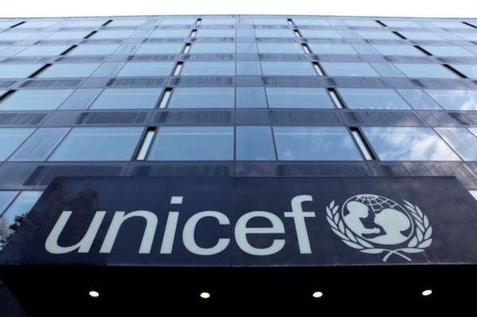
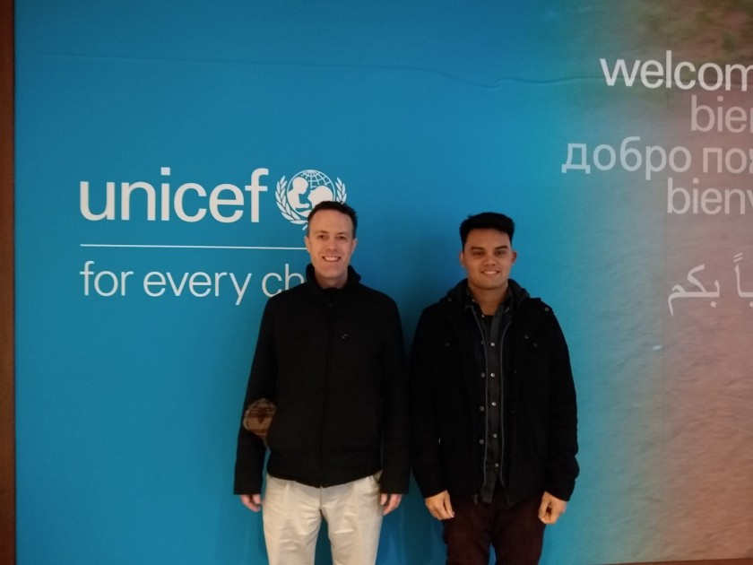

In my mother’s childhood, when Bangladesh herself was newly-born, her father would bring home blankets emblazoned with the UNICEF logo, a comforting blue. This same blue, painted on the canvas banners of the UNICEF lobby, where I waited for my supervisor Mike Fabrikant to sign me in for my first day as a Software Engineering intern.

As I leaned against the couch in the lobby, I traced a route in my mind’s eye — from the Dhaka hospital where I was born, to the teensy-weensy lead-chipped apartment my parents and I sidled into when we arrived here in the new millennium, to the finale of my academic career at Wesleyan where I finished up my B.A. in Computer Science and Theater.

“How did I get here?”

This question was fueled by a Matcha-Yerba Mate infusion I had concocted that morning, heated with a silent prayer that the pen-and-paper knowledge gained from my Computer Science courses would translate well to this particular opportunity. My internship was already on its way; just a week after final exams ended that semester, I was installing React packages and running Docker containers to view UNICEF’s Magicbox platform for myself.

Magicbox is an open-source multifaceted collaborative platform for aggregating, ingesting, and understanding the big data corresponding to specific phenomena in UNICEF programme countries, from connectivity to disease outbreaks. Crafting visualizations and developing machine learning models from the data collected can go a long way in predicting and planning for natural disasters, epidemics, or other exogenous factors that may disrupt wellbeing.

I knew quite well about the phenomena faced by developing countries on the other side of the world — whether it be my performative writing seminar where race and class was on everyone’s breath, or my course on social entrepreneurship and philanthropy — Bangladesh and/or its third-world problems were a persistent thread. Having moved to the U.S. so young, I was only familiar with the sensations of my country of origin — the heat and humidity, the fabrics and clear skies — distinct from the powerful and monolithic view of the United Nations towers from the UNICEF innovation office.

There, Mike and my other supervisor, Marcella Maki, helped me discern my route through this internship, which was partly remote and partly onsite. My fellow intern, Courage Angeh, was working remotely from Cameroon, which made for an interesting dynamic as I was often one of two interns present in the UNICEF Innovation offices.

I couldn’t believe how fortunate I was, that I’d be able to look after my family and prepare for my final semester at Wesleyan while transmuting the conceptual into the concrete. These next two months were spent in a deep dive of scientific computing, geospatial analysis, virtual machines, and plenty of tea — of course. In Part II of this piece, I will describe how I tackled healthsite accessibility, the challenges faced, and why it affirmed my desire to code with purpose.

_Me and my supervisor, Mike Fabrikant._