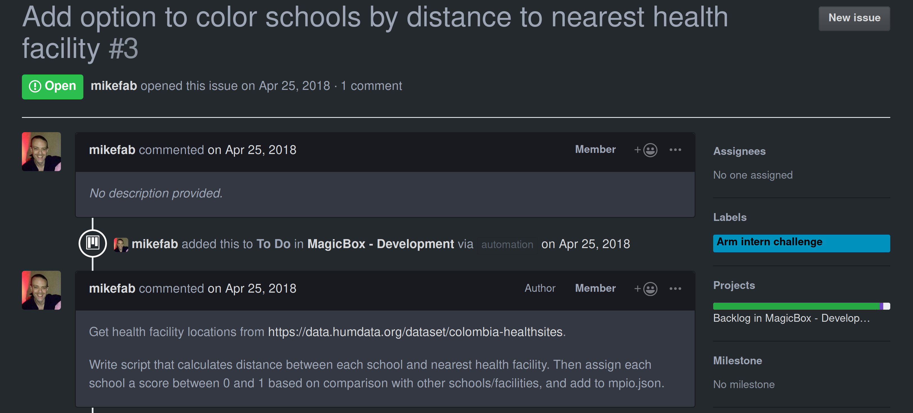
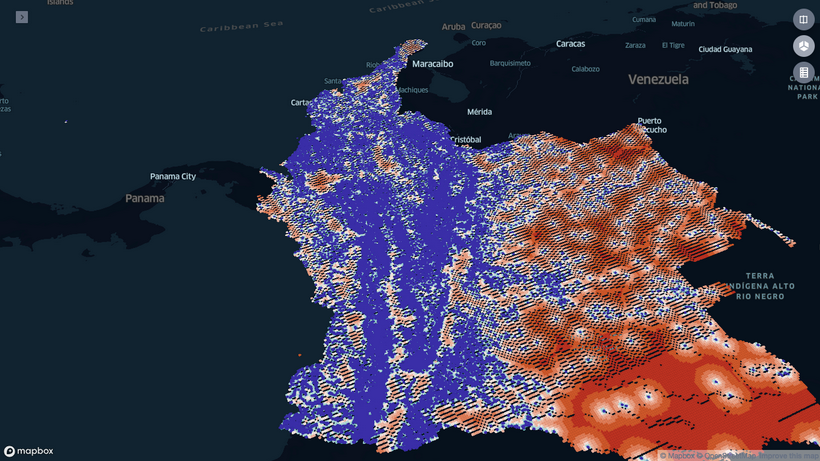
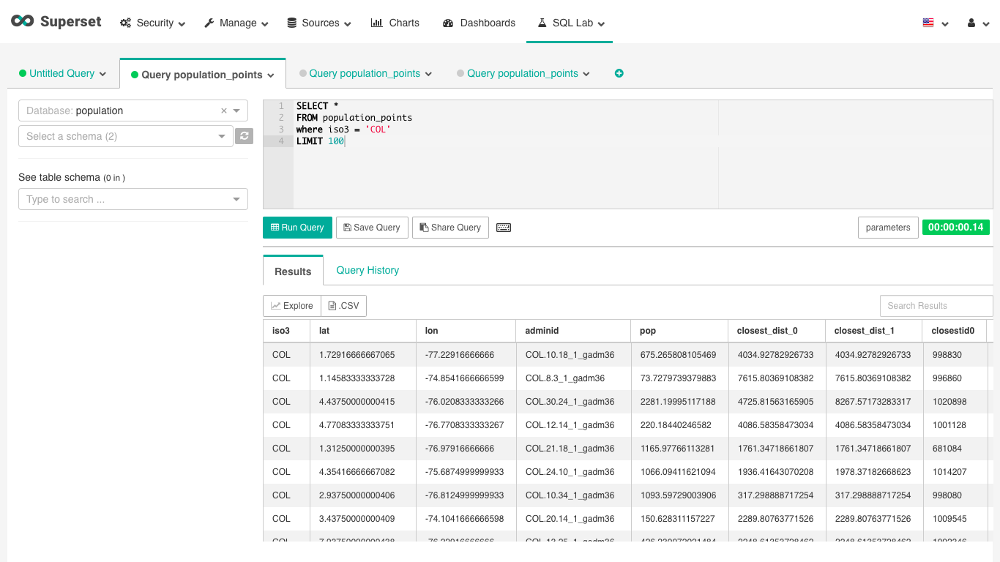
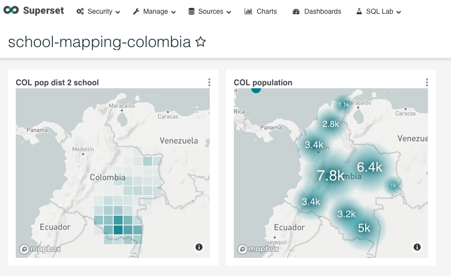

“Ah, no wonder all of these distances are millions of miles away - the input file had the latitudes and longitudes flipped!”

I pressed my fingers against my temple and giggled in relief, wishing I had caught this error before my recent code push. We were nearing the halfway point of my winternship, and I had begun prototyping a utility that would assist Magicbox developers in mapping healthcare accessibility.

I hadn’t expected my curious pursuit of an unresolved issue on the Magicbox Github repository to be this engaging and fun - but I knew I was on the right track. Each minor frustration was further evidence that the training wheels of my university’s computer science curriculum were coming off.

The problem statement was straightforward - for each location in a given list of geographic coordinates, identify the distance / travel time to the nearest health facility. For example, we might have a list of schools for a given country, with each school having attributes such as size, curriculum type, internet connectivity, etc.

We sought to add “distance to nearest health site” as an attribute for these schools, and to use Magicbox visualization tools such as kepler.gl to present these geographic points and have the option to color-code them by distance to the nearest healthsite - akin to the following picture, which ended being our final output:

_A kepler.gl visualization of schools color-coded by distance to health facility._

Physical access to health facilities is something taken for granted in dense urban metropoles like New York City, but in the rural and remote settlements that populate third-world UNICEF programme countries, distance and travel time to health sites is critical to whether or not an area’s infrastructure is prepared to rapidly provide medical services, and has an impact on controlling disease outbreak or childhood mortality. In rural Nigeria, utilization of health care facilities has been found to decrease exponentially with distance. It was apparent that computing and visualizing access to these facilities across all UNICEF programme countries would be of great value.

Of course, although schools, population points, and health facilities were the specific types of locations the Magicbox developers were using, the problem statement is agnostic as to what each geographic coordinate contained. I approached the issue by treating it as a generalized nearest neighbor problem, and identified two notions of ‘distance’ - straight-line, and routed.

Straight-line distance is the absolute geographic distance between two points, which requires a specific distance metric known as Haversine due to the Earth’s curvature. It does not factor in natural barriers or manmade infrastructure, for example, if I knew the straight-line distance from my home in Queens to my friend’s house in Brooklyn, walking an uninterrupted path to there would be impossible.

Instead, I must take into account routed distance, which uses transportation networks to route the path from one site to another. This means that depending on the nature of this network, it may more physical distance to get from Queens to Brooklyn since the train I took must stay on its track and pass through Manhattan. One can infer that the developing infrastructures in the countries we were analyzing may lead to greater disparities in the straight-line vs. routed distance - i.e., how far away a facility was, and how long it actually takes to get there, which has a huge impact.

_A SQL Query running on population points._

Of course, all of these distance computations required speedy and efficient algorithms that could scale to hundreds of thousands of points. For computing straight-line distances for a set of points, I opted to use the popular Python machine learning library scikit-learn and its ball tree data structure to conduct a nearest neighbor search.

Trees are a popular data structure that allows partitioning datasets to speed up queries, such as nearest neighbor search, and scikit-learn’s ball tree allowed me to enter geographic latitude and longitude coordinates and came bundled with a haversine distance metric - sweet !

After familiarizing myself with tools such as numpy and pandas, I was able to load in a dataset of points and, for each point, find the nearest neighbor from the other set of points - i.e. for each school, I could quickly compute the distance in meters to the nearest health site. Occasionally - as mentioned at the beginning of this article - I would come across data entry errors where the X and Y coordinates were flipped, or an input was in kilometers, or no distance was returned.

Trial and error was key - I was sufficiently confident in my algorithms and data structures to know that my procedure was right, and I was in the right headspace to keep working, keep tweaking, keep twisting (there were quite a few moments where I used Google Maps to verify a correct distance - I always pumped my fist in excitement when it worked).

_Example output with Colombia population points._

My supervisors Mike and Marcella would hold me accountable through a daily 5 pm scrum that was either through Skype call or at the office. Scrum is a practice from agile methodology, where we convened to describe what we’ve done, as well as roadblocks and aspirations. I also attended less frequent full team meetings where we made adjustments to a UNICEF Innovation Trello board to monitor our progress. Magicbox also has a public Gitter channel where the open-source community can participate, and I would also check it and make inquiries about my approach to other developers.

Working with geospatial data felt empowering and gratifying; with a few keystrokes, I was manipulating points on the globe and performing extensive computations to address an important issue. But straight-line distances were only the first step - check out part III to see how I leveraged my CS skills and an excellent Python library to tackle routed distance and sign off from my internship !
