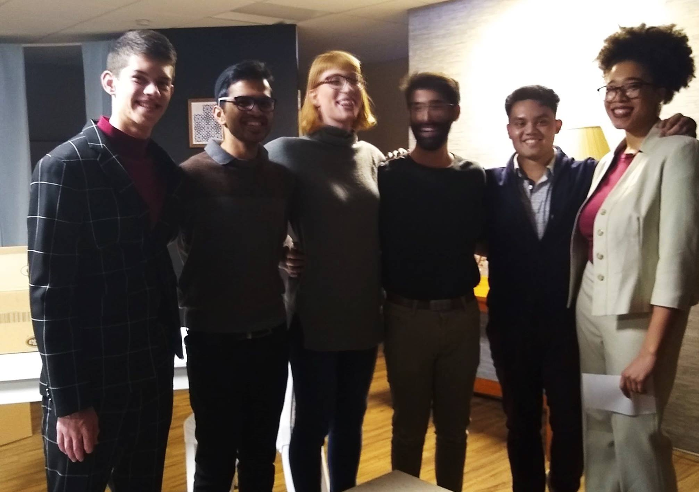

There is an unmatched clarity to creating art from limitation. 

In my Wesleyan junior fall, I seized such an opportunity. I directed the very play that thrust me into 
the realm of theater. 

Ayad Akhatar's "Disgraced" was first presented to me as an opportunity to leverage 
my identity as a young Desi male and perform several times as Hussein Malik / Abe Jensen, whose experience mirrors my own (to an extent, thankfully). The Readers' Theater of Connecticut had reached out to Wesleyan's Muslim Chaplain and to its Theater Dept. querying for someone who fit the description (a rare moment where, for a man of color, 'fit the description' was something undeniably positive).

At that time, I ached to act and probably would have accepted any role. I remember my freshman self dashing to the Office of Religious Life to meet with directors Anne Cassady and Richard Kamins, clearing my throat to try out for the part. No knowledge or preparation of the play beforehand, I was essentially cast because I was one of the first and only people to have responded to their casting call.

Fast forward to two years later; I was handing out sides for the parts I had grown to know almost as people in their own right. In my head, 'Isaac', 'Jory', 'Abe', 'Emily', and especially 'Amir' were real, and spoke to me, and each of them was the type of person who would be indignant if I botched their casting. 

I'd like to say I didn't! I wouldn't know, for as I was steeped in weeks of rehearsal, the actors in front of me grew into their roles so well that, as far as I was concerned, they _were_ the characters, just as I had become 'Abe' when I embodied him years prior. 

It was not a seamless beauty. We were, after all, university students (and in the case of one of my cast, a university employeee) for whom top grades and career aspirations were the priority. Second Stage, the production company sponsoring my play, is volunteer-based and entirely student-run, and our entire cast and crew had limited experience in theatrical production.

This was my first time directing, and although professional directing experience was available on Wesleyan's campus in the form of Directing I, II, and other courses, these were essentially inaccessible to me. I had always seen my theater major as a separate and smaller interest from my career path in software, I had never imagined that I would end up being one of the individuals on campus who would run a theater company, act in major productions, and direct a play. 

Seven courses, frequent physical therapy, being the lights liaison of a major production company, and directing a play. And yet, I felt an odd sort of freedom, the kind where I was able to choose my own pain and look forward to seeing this production come together. 

Personal and logistic limitations lent the play a unique authenticity, a sense of things being handcrafted and incidental. The stage was not a grand proscenium but an improvised black box in the basement of Wesleyan's Malcolm X House. The lavish NYC apartent Akhtar describes was framed by pieces of furniture borrowed both from the Center for the Arts, the office of Wesleyan's theater technical director, and people's personal possessions. My lack of experience as the lights liaison meant I could barely figure out how to actually bring theatrical lights into the space, so off to Ikea we went to obtain remote controlled lighting peripherals, and off to my room I went to grab my floor lamp.

But, I mean, Jesus. _Subhanallah_. 

I'm still in disbelief at how ragtag the process was and yet how cohesive the final product felt. Our limitations brought out a collective genius, where my team's experience in film and art translated to selecting the perfect wallpapers, furniture pieces, and props that could coexist in this communally crafted microcosm.

The aesthetic was a vibrant yet classy red, white, and dark shades of navy and black which cohered with the costume design and complemented by geometric patterns; the jazzy sound design provided this with a greater reality, ambience that cast judgment on the characters themselves. The set was flanked on the northeast by a handbuilt balcony setpiece that my set designer Angelica and her volunteer carpetners toiled to make which lent the illusion of an outer world, a clever method of masking the shattered glass prop that Arnaav needed to toss to the floor in a fit of rage.

There not being any theatrical incandescent lighting meant the set needed to be lit entirely by 'naturals' - a small table lamp near the 'fireplace', a floor lamp from my room, and LED strip lights near the 'lobby' - all of which were tethered to wireless light dimmers that needed to be on cue with certain moments. This ended up being a rather cool element; even though audiences were familiar with how theatrical lighting systems were set up with lightboards and specialized software, our system was entirely improvised and home-made and set within the confines of this residential area. The space was truly transformed.

I miss it, of course. I burn with nostalgia at this halcyonic winter, where I was provided both with freedom and restriction to collaborate and create a work of art that adhered so much to personal identity yet was blessed with community. It was a lighting flash, a moment trapped in amber and cast in flame. It could only have happened in my final year of college with this collective of individuals in particular.

I don't know if I am even a good theatermaker, if I am a decent actor or director, but I know that I enjoyed seeing the final product, and I know that I ache with a desire to do more. Even in the midst of writing this, there is more that I want to say (specifically about _why_ 'Disgraced' deserves a Pulitzer, but that is for another time).

A final thank you to all of the individuals mentioned here, my cast and crew, my team. Some of the artists of the future are mentioned in this very program. To them, I give much 💕.

_Official publicity photographs courtesy of Elijah Comas '22_

_That adorable directing photo courtesy of my Stage Manager Thanmye Lagudu '20_

